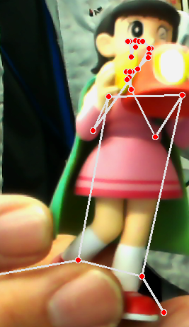

# Pose Estimation simply
Pytyorch and mediapipe working time calculation project
- pose estimation is utilized worker's working time estimation with simple control
- implemented mediapipe for working time estimation scripts

```
python torch_posecnt.py

```


# Summary of working time by body parts
- output realtime log is calculated to summary file by CSV.

```
python tmu_calc.py

```


## output example 

- worker pick up box and bring to the table
- It is stop watch estimation and MTM/MOST method hybrid

| part  | implemented TMU | Total time |
| ------------- | ------------- | ------------- |
| body_core_Landmark_  | 2.3732892125845  | 140.163228609999  |
| face_Landmark_  | 11.0471727277378  | 770.897757354996  |
| left_arm_Landmark_  | 10.4611928994656  | 420.489685829998  |
| legs_Landmark_  | 19.0501514985608  | 560.652914439997  |
| right_arm_Landmark_  | 10.3954701885979  | 420.489685829998  |

# Detection sample


