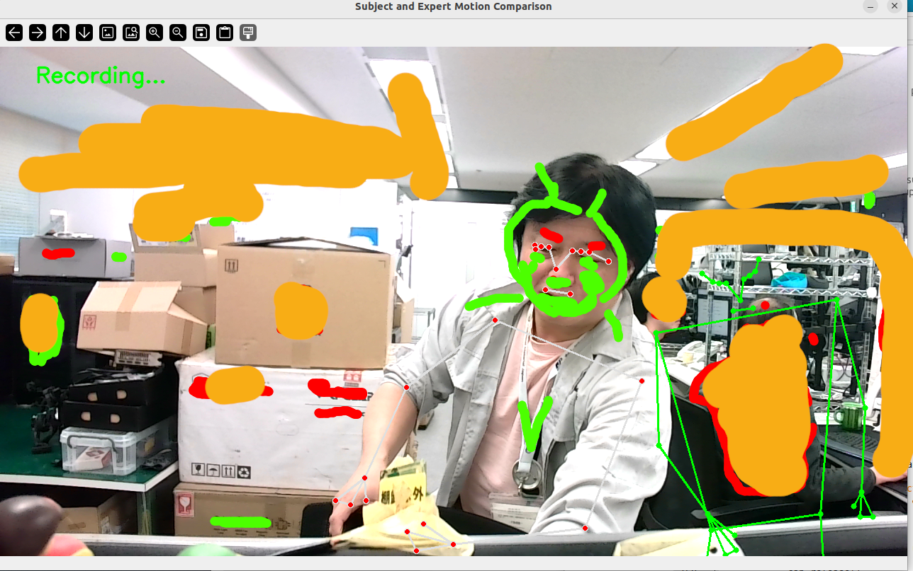

# Updated 2025 version
## Comparing veteran working style with novice worker mode
1. Adding normal distribution graph mode for the veteran and novice working time.
2. Auto calculation to improve your work efficiency
3. Recording veteran worker's working recording is upgraded to create statistics.

## How to

1. Recording veteran worker's working actual view

```
python torch_posecnt.py

```
 - The script will be output working time based on MTM/ MOST method.

2. Generate reference worker data

```
python tmu_calc.py

```
3. Comparision reference worker data 

```
python torch_movecom.py

```


# sample image
- Left side person is actual worker who is recording the working time.
- Right side person is reference worker data 


# Semi-automatic MTM/MOST working time measurement generator
- standard working time estimation system
  
# Pose Estimation simply
Pytorch and mediapipe working time calculation project
- pose estimation is utilized worker's working time estimation with simple control
- implemented mediapipe for working time estimation scripts

```
python torch_posecnt.py

```


# Summary of working time by body parts
- output realtime log is calculated to summary file by CSV.

```
python tmu_calc.py

```



## output example 

- worker pick up box and bring to the table
- It is stop watch estimation and MTM/MOST method hybrid

### Raw pose record by torch_posecnt.py

- Raw data is recorded each part X/Y coordinates　data 

| part  | X | Y | Visibility |
| ------------- | ------------- | ------------- | ------------- |
| Hand_Landmark_0 | 0.345010757446289 | 0.353788286447525 | 1 |
| Hand_Landmark_1 | 0.353723466396332 | 0.310025036334991 | 1 |
| Hand_Landmark_2 | 0.37304276227951 | 0.285368204116821 | 1 |
| Hand_Landmark_3 | 0.394926190376282 | 0.283487766981125 | 1 |


### Calculated working time

| part  | working time from TMU | RAW TMU |
| ------------- | ------------- | ------------- |
| body_core_Landmark_  | 2.3732892125845  | 140.163228609999  |
| face_Landmark_  | 11.0471727277378  | 770.897757354996  |
| left_arm_Landmark_  | 10.4611928994656  | 420.489685829998  |
| legs_Landmark_  | 19.0501514985608  | 560.652914439997  |
| right_arm_Landmark_  | 10.3954701885979  | 420.489685829998  |

# Detection sample


# Requirement

## Utilized MediaPipe and pytorch 
https://developers.google.com/mediapipe

```
pip install opencv-python
pip install mediapipe
pip install Pillow

```


# supplement (Japanese / English)

https://zenn.dev/manyan3/articles/738b524f197df2
